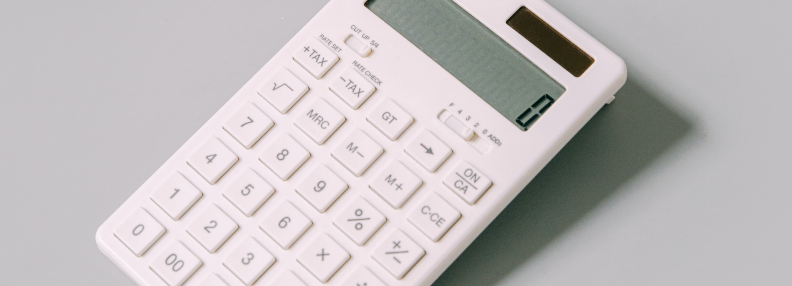

## Tutorial

This is a (hopefully) short tutorial for creating a simple calculator.

## How to Return Numbers
This is a block of JavaScript that returns the numbers when each button is clicked
```JavaScript
  btns.forEach(element => onEvent('click', element, function() {
  if (element.innerText !== 'Clear') {
    inString += element.innerText;
    outString += element.innerText;
    num += element.innerText;
  } else {
    inString = '';
    outString = '';
    num = '';
  }
  valid = true;
  canOp = true;
  input.innerText = inString;
  if (outString !== '') {
    value = eval(outString);
    output.innerText = value;
  } else {
    output.innerText = '';
  }
  }))

```
I created a function for each number button on the calculator, as well as the
'clear' button. If the inner HTML of the button is 'Clear' both the input and
the output will be cleared, as well as num, where I have the current number
stored. Outstring is the ouput of the calculation and will constantly be updating
to account for what you type in. To do this I used 'eval()', this will execute
everything in a string as a block of code.


## Return an operator
Operators look different in math class than they do on the keyboard. because of
this I needed to create a function to select the right operators, while still
keeping the site user friendly.
```JavaScript
operators.forEach(element => onEvent('click', element, function() {
  outside: if (canOp) {
    switch (element.innerText) {
      case '÷':
        inString += ' ÷ ';
        outString += ' / ';
        op = ' / ';
        break;
      case 'x':
        inString += ' x ';
        outString += ' * ';
        op = ' * ';
        break;
      case '+':
        inString += ' + ';
        outString += ' + ';
        op = ' + ';
        break;
      case '-':
        inString += ' - ';
        outString += ' - ';
        op = ' - ';
        break;
    }
    num = '';
    double = true;
    canOp = false;
  }
  input.innerText = inString;
  }))

```
When an operator is clicked it will trigger the switch case
which will find the correct operator and append it to the input string

## Returning the Value
  This is how I return the answer when the equals sign is clicked

```JavaScript
onEvent('click', equals, function() {
  if (valid) {
    next = op + num;
  } else {
    value = eval(value + next)
    
  }
  console.log(value);
  inString = value;
  input.innerText = inString;
  outString = inString;
  valid = false;
  output.innerText = '';
  })

```
While the answer is always updated it is still important to have an equals button.
This button will make the answer the single line of text, making it much more readable for the user.

There will always be a better way to do something, and this calculator is not
perfect. But, while you cannot divide by 0, it is functional in every other aspect.


Click [here](https://daboss02.github.io/calculator-tutorial/) to use.

## References
eval(): https://developer.mozilla.org/en-US/docs/Web/JavaScript/Reference/Global_Objects/eval

innerText: https://developer.mozilla.org/en-US/docs/Web/API/HTMLElement/innerText